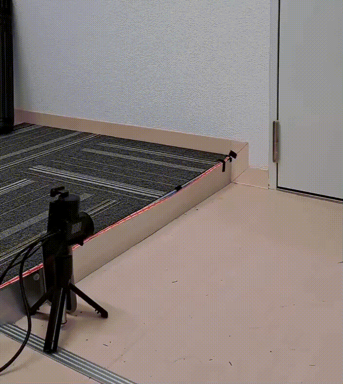
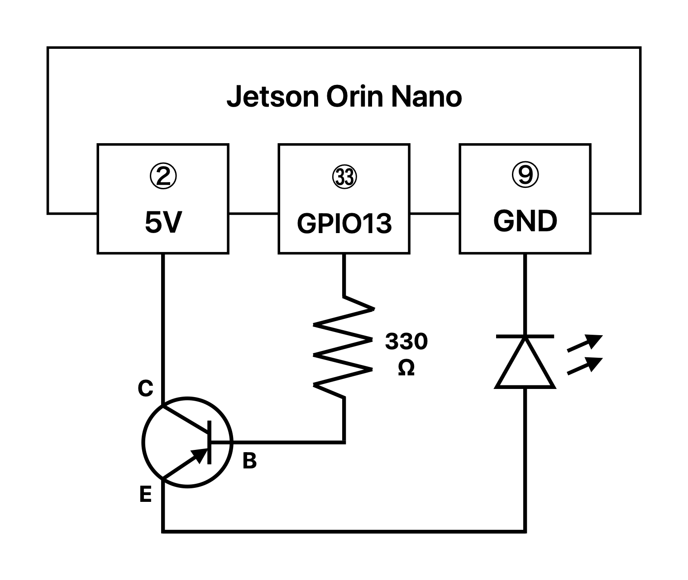
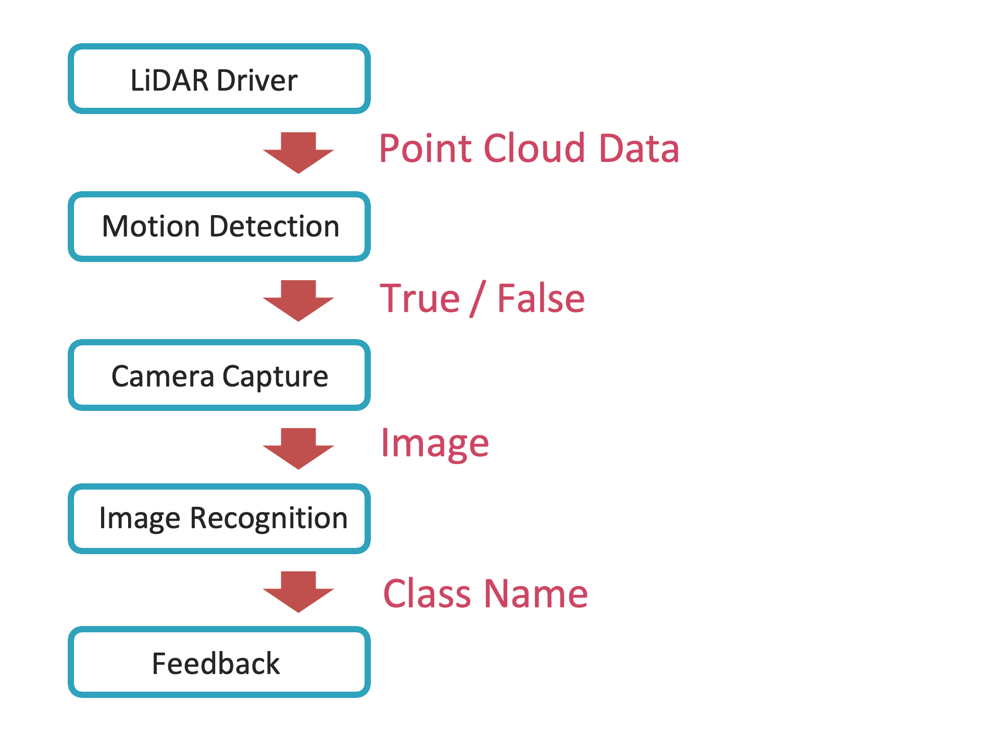

# Introduction
We have developed a shoe detection system using image recognition. This system determines whether a person passing in front of it is wearing shoes by analyzing their feet. If shoes are detected, the system issues an alert with sound and light.  
  
To enable image recognition, we created an original dataset consisting of images of feet wearing shoes, socks, and bare feet, along with exceptional cases where feet are not present in the image. We trained a ResNet18 model for four-class classification. Additionally, we used a 2D LiDAR to detect when a person passes in front of the camera, triggering image capture for inference. A speaker and an LED were employed to notify the person passing through based on the inference results. All programs controlling these devices and image inference were implemented using ROS2.

# Table of contents
1. [Background](#background)
2. [Requirements](#requirements)
3. [Setup](#setup)
4. [Running the application](#running-the-application)
5. [System overview](#system-overview)
6. [Data collection](#data-collection)
7. [Training](#training)
8. [Future directions](#future-directions)

# Background
Kyoto, a representative tourist destination in Japan, has many shrines and temples where visitors must remove their shoes before entering. Even when wearing indoor slippers, visitors must take them off and walk barefoot or in socks on tatami mats. This "no shoes indoors" culture is unique to Japan, making it difficult for foreign tourists to understand. As a result, incidents occur where visitors unknowingly violate the rules by wearing shoes indoors, leading to dirt and damage on floors and tatami mats.  
By using this system, it is possible to detect and warn people wearing shoes in no-shoes areas without the need for human supervision.

# Requirements
### Hardware
* Jetson Orin Nano
* Web camera(EMEET SmartCam C950)
* USB speaker
* 2D LiDAR (UST-20LX)
* USB LED strip
* USB extension cable
* Breadboard
* Jumper wires
* Resistor (330Ω)
* Transistor (A1015)
* Others (optional: tripod, etc.)
### Software
* Ubuntu 20.04
* ROS2 Foxy

# Setup
### Hardware
1. Connect the webcam to the USB port of the Jetson Orin Nano.
2. Connect the speaker to the USB port of the Jetson Orin Nano.
3. Connect the LiDAR to the Ethernet port of the Jetson Orin Nano.
4. Cut a USB (Type-A) extension cable and use the female end.  
Connect the LED to the female USB connector.  
Strip the inner wiring of the cut cable, using the red wire as the anode (VCC) and the black wire as the cathode (GND).
5. Use a breadboard, jumper wires, resistor, and transistor to connect the Jetson Orin Nano's GPIO pins to the LED as shown in the diagram below.
    
### Software
1. Clone the GitHub repository into the home directory.
    ```bash
    cd ~
    git clone http://
    ```
2. Build the ROS2 package.
    ```bash
    cd ~/ros2_ws
    colcon build --symlink-install
    ```
3. Source the environment.
    ```bash
    source install/setup.bash
    ```

# Running the application
Once the setup is complete, run the following command to launch all nodes:
```bash
ros2 launch ./src/my_inference_package/launch/multi_node_launch.py
```
### Troubleshooting
On ARM architecture Jetson devices, there may be an issue with Python's memory management for the OpenMP library (libgomp), which PyTorch depends on.  

> Example error message:  
> `ImportError: /lib/aarch64-linux-gnu/libgomp.so.1: cannot allocate memory in static TLS block`  

To force the dynamic library to load, run the following command:
```bash
export LD_PRELOAD=/lib/aarch64-linux-gnu/libgomp.so.1
```

# System overview
  
The system consists of five nodes:  

1. The "LiDAR driver node" continuously acquires sensor data from the LiDAR and passes it to the next "passage detection node."
2. The "passage detection node" extracts only the narrow-angle components close to 0° from the received point cloud data and determines whether an object is within the threshold distance of 0.6m. If an object is detected within 0.6m, it sends a `True` signal to the next "camera capture node," otherwise, it sends `False`.
3. The "camera capture node" captures an image only when it receives a `True` signal, reducing processing load by avoiding continuous camera operation (e.g., at 30 fps).
4. The captured image is sent to the "image recognition node" for inference. Instead of saving the image locally, it is transmitted directly via ROS topics to eliminate unnecessary storage operations and improve processing speed. Once inference is complete, the predicted class name is sent to the "warning output node."
5. The "warning output node" controls the appropriate pattern of light and sound feedback based on the received class name.   

This completes the sequence of operations using ROS2. Among the five ROS2 nodes, only the image recognition-related components were implemented in Python; the rest were written in C++ to maximize processing speed. By avoiding Python before inference, we minimized the time lag between detecting a passing person and performing inference. Additionally, since all programs are launched at the beginning, the inference model is loaded during startup, eliminating the need to reload the model each time inference is performed, further improving speed.

# Data collection
To ensure the system can distinguish between shoes, socks, and bare feet regardless of camera placement, images were captured under various conditions.
* Footwear data (shoes, socks, bare feet) was collected by placing the camera near the ground in pedestrian walkways.
* Exception data was collected by capturing images without feet, images of only the upper body, and various objects that might be mistaken for footwear.
### Key considerations
* Since the distinguishing features occupy a small portion of the image, training data images were cropped to focus mainly on feet.
* To prevent background-dependent classification (e.g., recognizing footwear based on background elements), the same shoes and socks were photographed in different locations with various backgrounds. This was intended to train the model to ignore background features.

By collecting data with these considerations in mind, we iteratively trained and tested the model, identifying misclassified cases and supplementing the dataset accordingly.

# Training
We trained the model using `resnet.py` with data augmentation techniques such as resizing, random cropping, horizontal flipping, translation, and distortion. The final trained weights file, `final_weight.pth`, should be placed in `ros2_ws` for inference.  
If you wish to retrain the model, ensure that directory paths are adjusted as needed.

# Future directions
The current model was trained using a dataset primarily composed of images featuring the shoes, socks, and skin tones of the development team members and their families, as well as backgrounds from their homes and the Gifu University campus. As a result, the model is limited in terms of the variety of shoes, socks, skin tones, and backgrounds it has been exposed to.
In the future, we plan to improve prediction accuracy by training the model with a more diverse dataset, including different types, colors, and patterns of shoes and socks, a wider range of skin tones, and various backgrounds with different lighting conditions.
